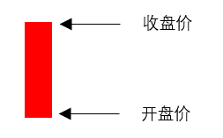
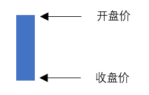
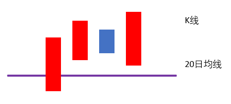
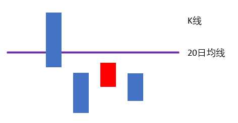
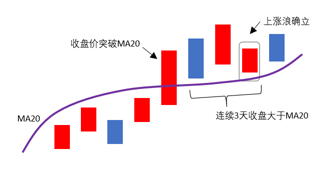
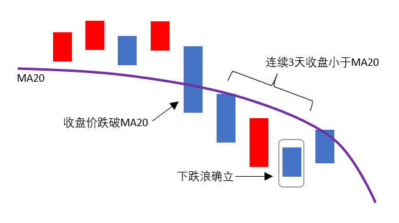

# 浪行解析

识别机构操盘的基本元素，正确区分阳线、阴线，判定上涨浪及下跌浪。

## 定义解析

K线分为阳线与阴线，定义如下：
阳线|阴线
-|-
收盘价 > 开盘价| 收盘价 < 开盘价
{:height="120px" width="200px"} | {:height="120px" width="200px"}

阳线，指收盘价大于开盘价；阴线，指收盘价小于开盘价。

### 上涨浪判定要素

1. 阳线收盘价突破20日均线
2. 未来3天收盘价在20日均线上方（*注：未来3天不区分阴线、阳线*）

{:height="160px" width="350px"}

### 下跌浪判定要素

1. K线收盘价跌破20日均线
2. 未来3天收盘价在20日均线下方（*注：未来3天不区分阴线、阳线*）

{:height="160px" width="350px"}

## 实战要点

1. “指数”只看整数位，不需要四舍五入
2. “个股”看小数点后2位，不需要四舍五入
3. 适用周期：日线

### 上涨浪确立形态

{:height="260px" width="500px"}

当天阳线收盘价大于20日均线，为当天突破。要求未来3天，每一天的收盘价全部站稳20日均线上方，则第3天确立，由前期下跌浪转为上涨浪。

突破，必须为阳线突破；如果是阴线突破，则说明上涨幅度一定不大，就没有跟踪、操作的必要，但数浪的时候，是要画出来的，所以在选择个股进行画线的过程中，只找阳线突破的个股，因为这样的个股，才有操作的必要。

### 下跌浪确立形态

{:height="260px" width="500px"}

当天收盘价跌破20日均线，为当天跌破，且要求未来3天，每一天的收盘价都在20日均线下方，则第3天确立，则由前期上涨浪转为下跌浪。

下跌浪，阴线、阳线跌破都可以，只是阴线跌破更强势而已。下跌浪的最低点，就是上涨浪的起点；上涨浪的最高点，就是下跌浪的起点。

## 注意事项

（1）如果收盘价等于20日均线，则不算突破，也不算跌破。（在收盘价和20日均线价格进行比较的时候，只需要看到小数点后2位，且不需要四舍五入）
（2）如果阳线突破20日均线以后，未来三天中有一天价格等于20日均线，其他两天在20日均线上方，算跌破吗？这种情况不算跌破，上涨浪成立。
（3）突破后，接下来的3天，只看收盘价是否站上20日均线，无论该K线是阳线还是阴线。
（4）突破成立后，如果连续3天的收盘价不满足要求，则突破不成立，需要重新确立突破，再看3天。
（5）不管浪形多短，都算上涨浪或者下跌浪.
（6）只有在上涨浪中，个股才具有上涨50%~80%的能力。
（7）永远只在上涨浪里买入及持有股票，永远不在下跌浪里买入及持有股票。
