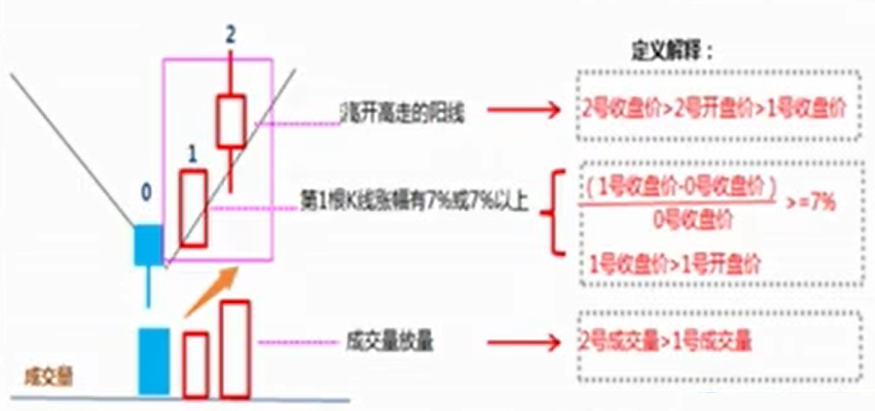
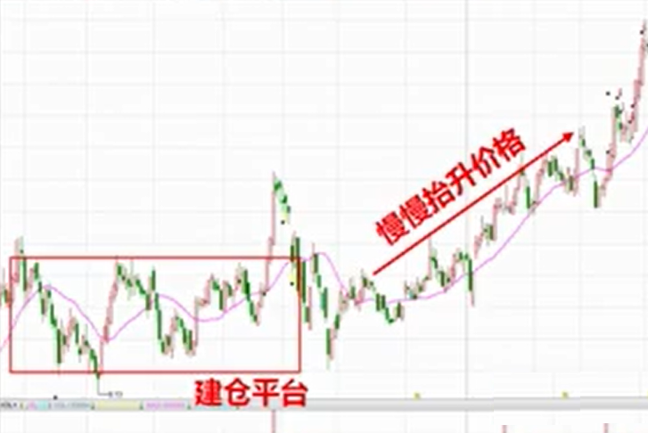

# 区分短线中线股

在买入个股的第一时间需要确认个股是短线还是中线。短线与中线个股的选股策略与操作策略完全不同，原因在于，如果当前机构参与的是短线个股，机构资金参与快速拉升，一旦拉升完成即出货，不具备再次创新高能力，回调时间周期全面加长，可达半年、一年甚至两年或更久。

需要注意的是，短线和中线操作策略很容易弄混；明确中线个股做中线、短线个股做短线。

## 短线股特征

收7%以上阳线，第二天高开高走成交量放量阳线，为短线个股特征，否则为中线。

- 涨幅快、周期短，1、2周，一个月内
- 短期利率大
- 具备连续大阳线能力

注：第二天高开一分钱，不算，需要看到明显的高开才算。

短线个股筹码松动卖出。

## 中线股特征

1. 底部慢慢抬升价格，属于中线个股
2. 中线个股需要有建仓痕迹，在底部要有建仓平台

- 涨幅慢、周期长
- 年利率稳健，以半年或一年计算收益率
- 中线个股一旦拉7%阳线无法持续，短线不操作
- 连续拉升即到顶结束
- 打算做中线，持股和操作周期三个月起算

中线股才具备大资金的布局能力，需要很长时间的建仓周期及洗盘周期。

假定从10块开始拉升，目标价50块，如果短线操作直接拉升从10块到20块需要7个10%涨停板，再到30块需要5个涨停板，再到40块需要4个涨停板，到目标价50还需要3个涨停板，计19个涨停板，不可能。中线个股底部价格慢慢抬升，从10块钱慢慢抬高底部价格到30块，只需要7个涨停板就可以到达目标位。
