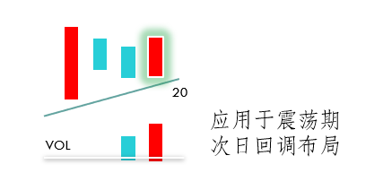
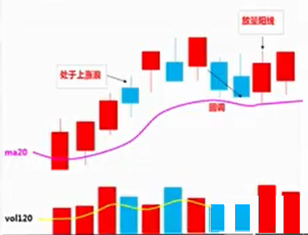

# 回调完毕买入法

当前个股出现回调下跌后的买入方法。适用对中线个股买入时机的合理把握。

## 回调完毕买入法要素

个股前期上涨过，不追涨，后期缩量回调，出现放量阳线，表示回调完毕。

注：下跌浪背离区间也适用。

## 放量阳线的要求

- 放量阳线**收盘价**小于前期回调阳线**收盘价**。
- 放量阳线**收盘价**大于20日均线。
- 放量阳线当天仍属于**上涨浪**。

## 实战要点

意义：回调完毕代表前期风险得到释放，个股的动能重新活跃，后期上行几率大。

买点：出现回调完毕买点之后，次日盘中即可布局，如配合最佳盘口，则会提高成功率。

方法：回调完毕买入法是用来确认买点的方法，不能用于选股。
