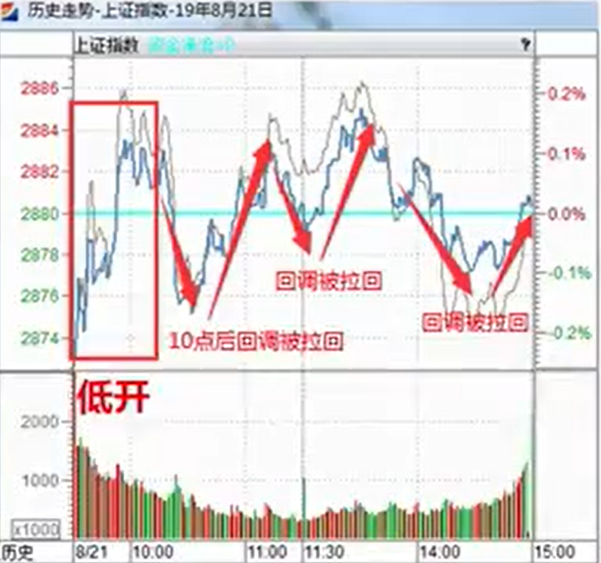
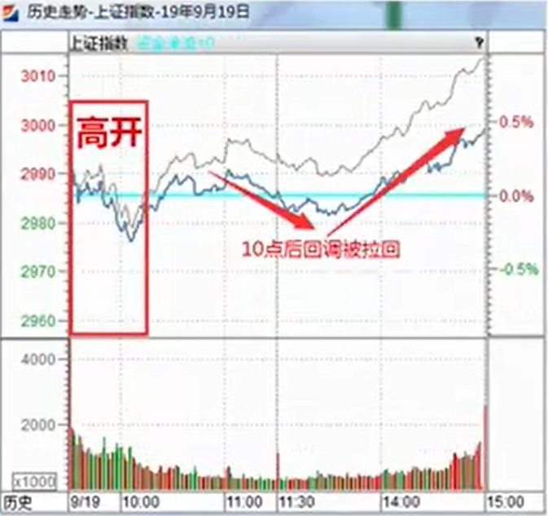
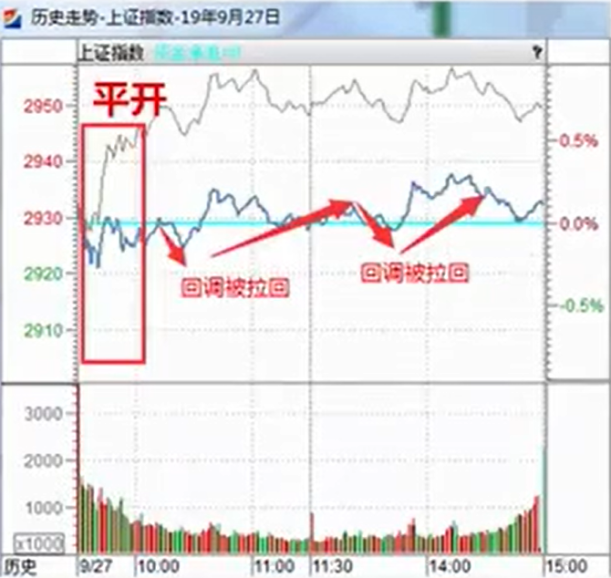

# 最佳盘口

最佳盘口，看的是上证指数。适用于上证指数的看盘方法。

## 低开最佳盘口

1. 低开（今日开盘价 < 昨日收盘价）
2. 10点前回补过缺口
3. 10点整价格在昨日收盘价格上方，同时均价线在价格线上方运行

## 高开最佳盘口

1. 高开（今日开盘价 > 昨日收盘价）
2. 10点前回补过缺口
3. 10点整价格在昨日收盘价格下方，同时均价线在价格线上方运行

## 平开最佳盘口

1. 平开（今日开盘价 = 昨日收盘价）
2. 无缺口
3. 10点整价格在昨日收盘价格下方，同时均价线在价格线上方运行

注：均价线代表不加权指数线（小盘股），价格线代表加权指数线（权重股）

## 实战要点

意义：通过当日盘口分析，提前确立短线最佳进场时机。明确最佳盘口的操作意义：下跌能拉回（注：根据不同开盘方式拉回的程度不一）

步骤：第一步：确立开盘情况；第二步：确立缺口是否回补；第三步：确立10点整价格形态

最佳盘口代表机构完成洗盘效果完毕，当天布局体现收益概率大。
