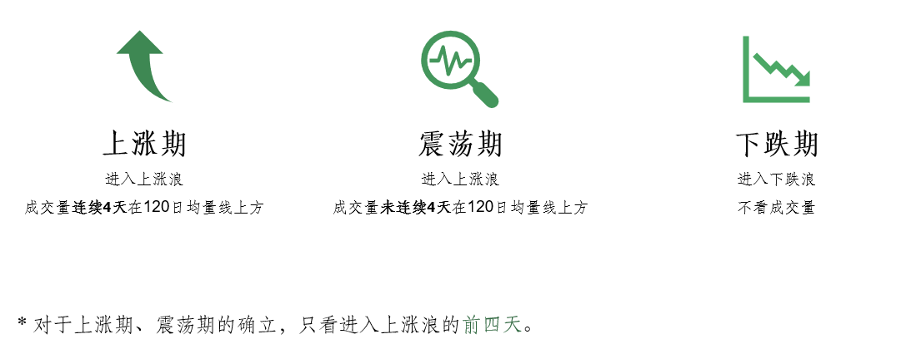
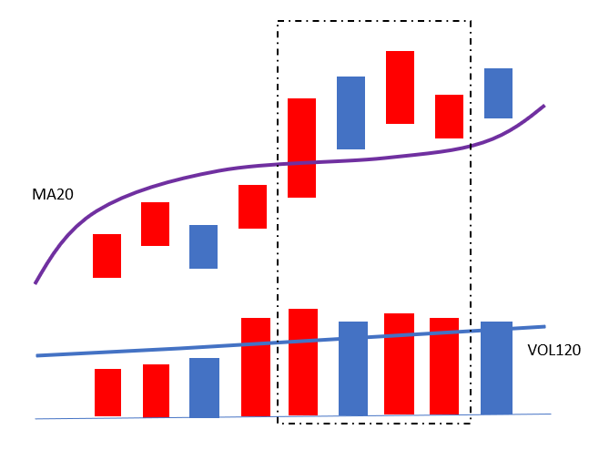
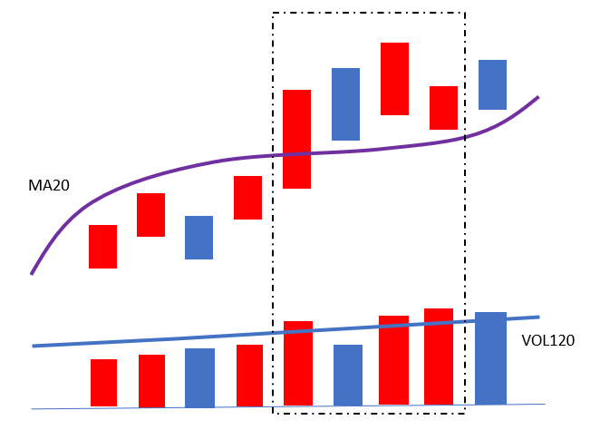
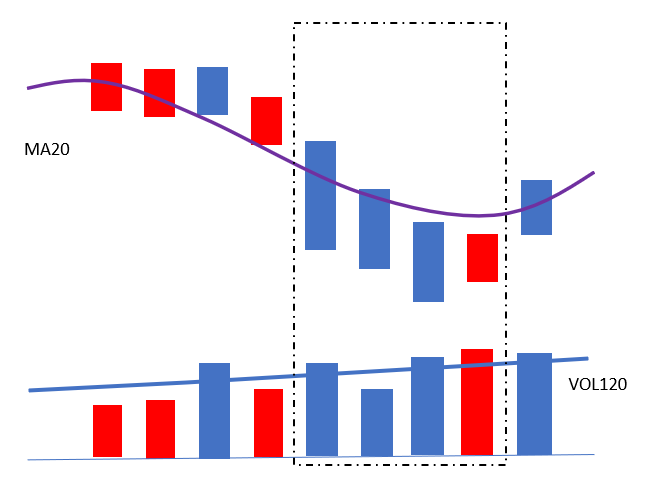

# 市场环境

市场环境可分为**上涨期**、**震荡期**和**下跌期**。判定标准依据为20日MA均线及120日成交量均量线。

## 上涨期

1. 指数处于**上涨浪**
2. 突破当天及未来3天对应的成交量都在120日均量线上方

{:height="300px" width="520px"}

## 震荡期

1. 指数处于**上涨浪**
2. 突破当天及未来3天对应的成交量**没有连续**在120日均量线上方

{:height="300px" width="520px"}

## 下跌期

1. 指数处于下跌浪中运行
2. 不考虑成交量形态

{:height="300px" width="520px"}

## 实战要点

针对不同市场环境，制定不同的交易策略，是需要重点把握的规则要点。

- 上涨期：上涨能力大于下跌能力。
- 震荡期：维持横盘震荡及箱体震荡，不追涨。
- 下跌期：下跌能力大于上涨能力。

注：机构操盘周期通常包括**建仓**、**洗盘**、**拉升**及**出货**。机构建仓需要3个月左右的时间，洗盘3个月左右时间，即至少6个月机构才能达到拉升能力，故采取半年线即120日均量线为成交量活跃判断标准。

- 判断市场环境以上证指数为准。
- 成交量柱体在120日均量线上方，表示成交活跃。
- 对于上涨期、震荡期的确立，只看进入上涨浪的前四天。
