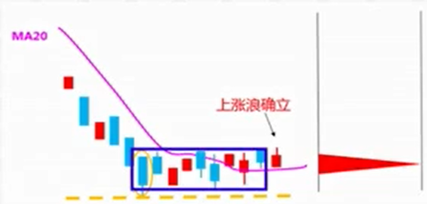
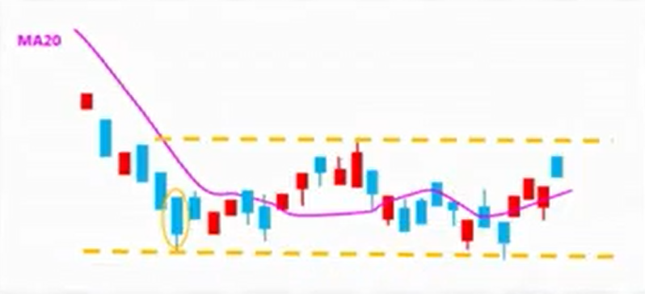

# 建仓形态

建仓形态包括**横盘建仓**、**箱体建仓**。

## 横盘震荡

{:height="260px" width="500px"}

1. 指数一波下跌
2. 收盘价不创最低点（阴线）新低
3. 连续横着走，维持窄幅震荡
4. 上涨浪确立前底部筹码顶格为**横盘建仓完毕**

## 箱体震荡

{:height="260px" width="500px"}

1. 指数一波下跌
2. 上涨浪和下跌浪相互交替
3. 下跌浪收盘价不创新低
4. 上涨浪收盘价不创新高
5. 阳线收盘价突破箱体最高点为**箱体建仓完毕**

## 实战要点

（1） 横盘震荡一波下跌后，有一根阴线创出最低价，阳线无效（忽略该阳线）。

- 下跌中要达到机构建仓的标准必须要由阴线形成，只有阴线的下跌才能清理跟风盘，吸引散户卖出筹码，机构达到建仓能力。
- 最低点后**5个**交易日收盘价不创新低即平台确立。

（2）箱体震荡建仓区间内，操作策略以高抛低吸为主。表示下跌后也具备拉回能力，上涨后依然具备回调能力。
