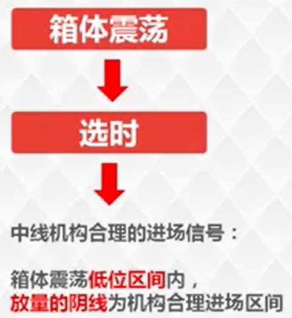
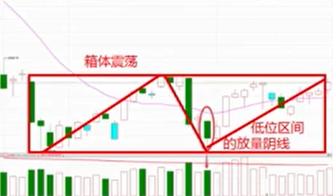
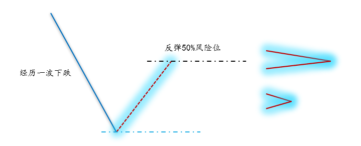

# 箱体震荡的选时

做好一只个股，需要满足三个方面的条件，即1）在正确的时间，2）采用正确的选股方法，3）选到适合当前时期下正确的个股，才能做到个股上涨体现收益的最大成功率。

把握合理的选时为一个重要的方面。对本次内容的学习，对于把握合理的指数下跌后的选时和正确的买入时间阶段，一旦形成该方式，就能达到合理进场时机，即具备未来指数上行个股体现收益最大化标准。

**箱体震荡**：指数维持一个箱体（有上涨浪下跌浪交替，下跌浪不创新低）震荡建仓完毕的标志是阳线突破箱体高点新高。

## 中线进场信号

箱体震荡**低位区间**内，**放量的阴线**为机构合理进场区间。

低位阴线的放量，只与前一个交易日进行比较。

## 风险位判断

风险位的出现有以下两种形式：

（1）指数建仓完毕后，随着指数的上涨，出现“底部建仓筹码缩短，上方筹码加长顶格”形态，则表示指数进入短期风险位。
（2） 指数下跌一波后，迎来反弹，但反弹至下跌浪的50%位置，则表示指数进入短期风险位。

风险位附近，短线合理回避及高抛，把握利润获利了结。
