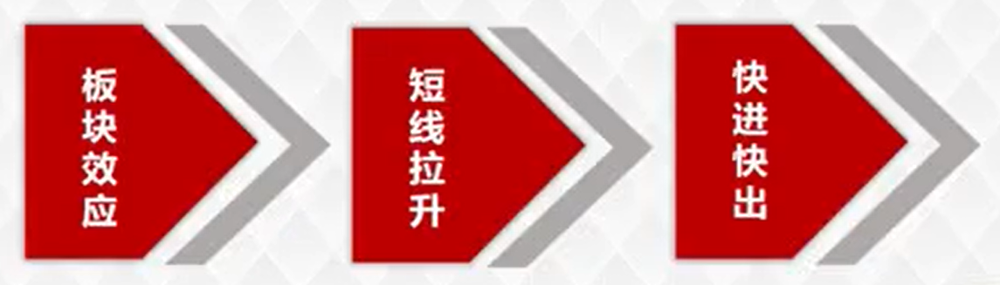

# 短线拉升形态

本节内容讲解的是短线拉升形态。通过本节内容的学习，可以让大家明确对短线个股和中线个股的区分，把握短线具备拉升形态规则个股，明确其买入方式及参与方式。

## 形态条件

1. 涨幅为**7%及以上的阳线**
2. 次日**高开放量阳线**

{:height="200px" width="260px"}

为什么是7%的阳线才属于短线拉升形态？是因为，对于机构操盘手法，短期内机构要进入快速拉升一定会在第一时间快速甩开当前散户的跟风盘，而要达到这一目的，往往会出现大阳线的拉升形态。快速拉升至7个点幅度以上，才能回避散户投资者的跟风，因为

- 当天上涨幅度7%以上，表示很多散户投资者倾向于认为参与10%涨跌幅限制股票规则下风险大于收益。
- 次日高开快速偏离前一交易日收盘价，成交量大于前一天资金快速买入，达到甩开散户追涨能力。

注：放量是指今日成交量大于昨日成交量。

## 实战要点

在满足板块效应条件的板块中选择短线拉升个股，体现收益快进快出。在合理板块效应规则下，选择短线拉升个股，明确当前快进快出，一旦达到短线收益完毕出局，获取短线最大利润化的体现。

短线个股选股及操作流程

