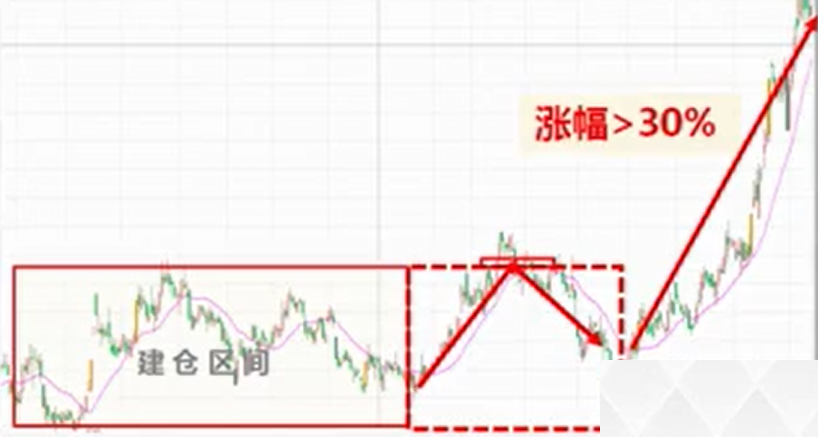

# 机构卖出形态

本节课程介绍卖出形态中高抛、出货方式。

## 机构高抛方式

机构高抛方式不属于机构的全部卖出，而是属于机构把前期筹码抛出一部分，将当前资金落袋为安获利了结，达到前期利润锁定能力。

1. 前期低位完成低吸建仓 （[横盘建仓、箱体建仓形态](pr3.md)）
2. 机构拉升一波幅度大于30%
3. 机构在高位将30%-50%筹码卖出，但仍有绝对的控股权
4. 维持震荡走势

通过前期低位缩短的幅度来确定机构卖出份额。低位筹码缩短但仍高于50%，即表明机构属于高抛而不是出货，接下来还具备回调下跌后的一波上涨能力。

对机构操盘手多年来买卖交易规则的统计，当机构要完成一只个股的建仓，到拉升完毕的出货，往往有30%的利润是属于当前的合理的拉升建仓成本。一只个股建仓价格如果在10块钱，拉到13块机构不赚钱，因为包含了建仓的手续费及出货交易费成本，拉升到15块获利20%，拉升到18块才能达到获利50%的能力，这是机构完成建仓、洗盘、拉升、出货四个阶段的过程。

## 机构出货方式

出货就是机构完全卖出。这种情况下，机构已离场，个股下跌的力度及空间全面加大。

1. 前期低位低吸建仓
2. 机构拉升一波幅度大于30%
3. 机构在高位将80%-100%筹码卖出，代表机构完全出货获利
4. 个股具备创新低能力

