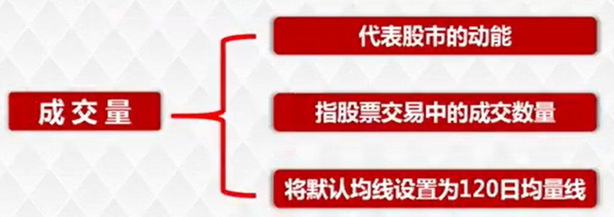
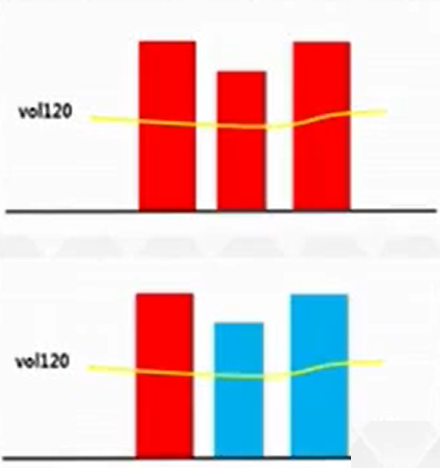
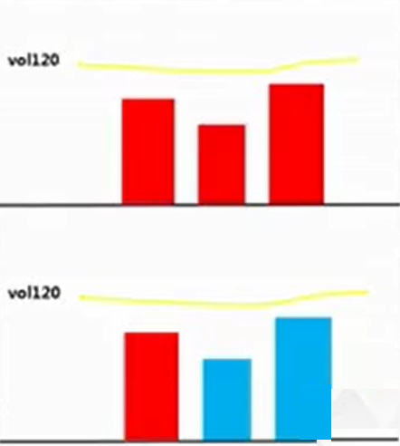

# 上量形态

成交量指股票交易中的成交数量，代表股市动能。

120日均量为半年均量线。建仓、洗盘、拉升及出货四个周期，机构才能完成参与的全部过程，三个月建仓、三个月洗盘对应的大概就是半年均量线标准。VOL柱状体收于120日均量线下方，表示成交不活跃阶段，机构参与能力不强。

## 上量形态判定

1. 与阴线阳线无关，只看成交量
2. **连续3天**成交量都在120日均量线上方

满足上量形态，即能满足当前活跃度增加的标准。

## 下量形态判定

1. 与阴线阳线无关，只看成交量
2. **连续3天**成交量都在120日均量线下方

下量，表示活跃度减弱，当前个股成交不活跃，动能不足无法支撑上涨浪出现一波大的上涨行情。

永远只参与上涨浪且成交量上量的个股。

扫描下方二维码查看课程视频
{:height="120px" width="120px"}
