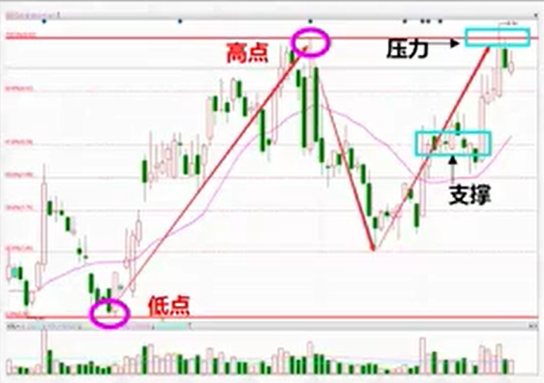

# 黄金分割线

本节讲解黄金分割线的基础入门使用方法及实战要点。

## 使用方法

1. 根据上涨浪，下跌浪规则画出浪行（[浪行解析](pr1.md)）
2. 将前一波上涨浪低点同高点相连

黄金分割线是基于当前对机构多年操盘策略的了解、统计和分析，所总结出来的一套画线规则。

## 实战要点

意义：帮助快速找到当前的“支撑位”、“压力位”、“空间位”，明确运行方向，具有重要的指导意义。

买卖：黄金分割线压力位附近，表示个股上行有压力，处在风险位，此时震荡及下跌概率加大，因此压力位附近不适合布局操作。

适用：指数、个股
