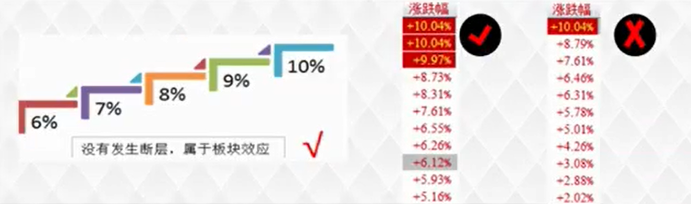

# 板块效应

## 定义解析

板块分为：行业板块、概念板块、地区板块

判断标准：板块所含个股的涨幅按照10% 9% 8% 7% 6% 涨幅不断层排列

根据多年来机构操盘过程及板块轮动性总结出来的一套方法，关注的重点是板块。这种特征一旦出现，表示当前板块具有持续上涨能力，板块中的个股上涨概率加大。学习板块效应，在于更好地找到当前短期上涨能力的个股所出现的最大概率化的板块范围，在具有板块效应的板块中参与个股操作，应该能够更好地把握当前选股范围的精准化。

当前板块的上涨具有龙头股的带动，又有次龙头的跟涨，不是某只个股受消息面刺激带来的上涨。在这样的板块中，板块持续上涨能力加大。

## 实战要点

意义：具有板块效应的个股短期拉升概率加大，结合短线战法使用。

查看：市场监测 - 板块监测 - 涨幅排名前20的板块（行业、概念、地区）按规则翻看
