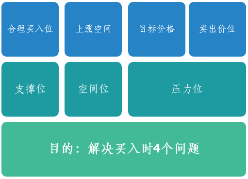

# 机构操盘线（黄金分割线）

## 学习目的

解决个股买入问题，买入第一天，就能明确该个股在哪里可以买入（支撑位），有多少上涨空间（空间位），目标价格在哪里（压力位），短期压力位在哪里。

- 支撑位：个股运行过程中明确跌到哪里是支撑，只有在接近支撑位的时候，才是合理的买入位置；
- 压力位：个股运行过程中明确涨到哪里是压力，接近压力位的时候，一律不得买入；
- 空间位：能够明确个股上涨的空间位，即在买入的当天就会知道，该个股可以涨到多少钱；
- 回调位置：能够找到回调支撑位，及回调过程中，中线的合理建仓位。

## 课程内容

[主力操盘线画线规则](sec0.md)

识别浪行，在浪行前一波上涨浪画黄金分割线。以及上涨趋势的识别。

[操盘线回抽确认](sec1.md)

开盘价回抽确认，收盘价回抽确认、下影线回抽确认。
