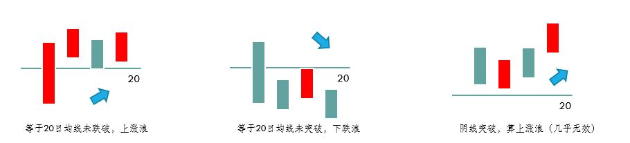
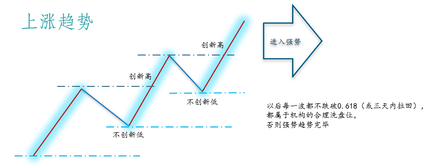

# 主力操盘线画线3规则

## 浪行画线注意事项

- 如果收盘价等于20日均线，则不算突破，也不算跌破。（在收盘价和20日均线价格进行比较的时候，只需要看到小数点后2位，且不需要四舍五入）
- 如果阳线突破20日均线以后，未来三天中有一天价格等于20日均线，其他两天在20日均线上方，算跌破吗？这种情况不算跌破，上涨浪成立。
- 突破后，接下来的3天，只看收盘价是否站上20日均线，无论该K线是阳线还是阴线。
- 突破成立后，如果连续3天的收盘价不满足要求，则突破不成立，需要重新确立突破，再看3天。
- 不管浪形多短，都算上涨浪或者下跌浪.
- 只有在上涨浪中，个股才具有上涨50%~80%的能力。
- 永远只在上涨浪里买入及持有股票，永远不在下跌浪里买入及持有股票。

## 黄金分割线画线规则

（1）永远只画上涨浪；
（2）永远只画前一波上涨浪；
（3）取前一波上涨浪最低点为起点，最高点为终点，把高点低点连接起来画黄金分割线。

画线小技巧。操盘手软件画线步骤：
（1）点击画线工具中的“黄金分割线”，出现小铅笔；
（2）找到区间最低点的那一根K线，按住键盘中的“向下箭头”，直至“向下箭头”不再向下移动，则为当天最低价格；
（3）点击鼠标左键，出现黄金分割线，拉至区间最高点那一根K线；
（4）按住“向上箭头”，直至小铅笔不再移动，松开即可。

## 黄金分割线需要看的位置

黄金分割线只看0.236、0.382、0.50、0.618、1、1.618、2.618，用于找支撑位、压力位；现价下方的每一根线都是支撑位，现价上方的每一根线都是压力位，支撑位与压力位之间为空间位。

### 上涨趋势（用于判定大盘强弱）

#### 1、为什么要学习上涨趋势？

（1）明确什么是强势；
（2）上证指数只有进入上涨趋势，才有可能出现所谓的“牛市”。

#### 2、什么是上涨趋势？

由3波上涨浪组成，由2波下跌浪组成。要求每一波上涨浪创新高，创新高在于本波上涨浪中有阳线收盘价大于前一波上涨浪的最高价，每一波下跌浪中不能有K线收盘价低于前一波下跌浪的最低价。

#### 3、大盘上涨趋势对个股的影响

上涨趋势的出现，表示大盘处于强势，这时80%个股出现一波大幅度的上涨浪可能性很大。
