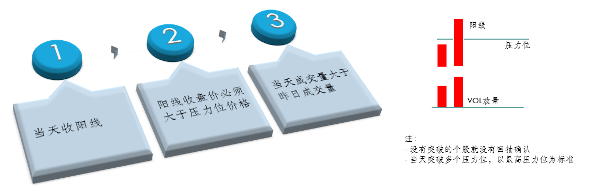
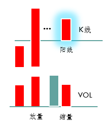
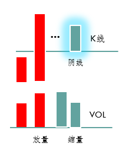
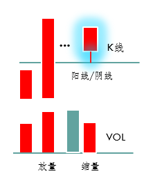

# 操盘线回抽确认

## 突破压力位

没有突破的个股就没有回抽确认。突破压力位的认定要素：

1、当天收阳线；
2、阳线收盘价必须大于压力位价格；
3、当天成交量大于昨日成交量。

## 回抽确认的三种形态

以0.618举例说明。注意，回抽价格等于确认位置的价格规则：

- 指数：可以上下浮动3个点。
- 板块：可以上下浮动2个点。
- 个股：可以上下浮动0.01元，也就是1分钱。

### 1、开盘价回抽确认

（1）突破0.618压力位；
（2）后期的某一天，开盘价直接开在0.618的线上；
（3）当日收阳线；
（4）当天相比昨天缩量，即成交量小于昨日成交量。

### 2、收盘价回抽确认

（1）突破0.618压力位；
（2）后期的某一天，开盘价开在0.618上方，收盘价刚好收在0.618；
（3）当日收阴线；
（4）当天缩量。

### 3、下影线回抽确认

（1）突破0.618压力位；
（2）后期的某一天，开盘价开在0.618上方，下影线刚好触碰0.618；
（3）阴线、阳线皆可；
（4）当天缩量。

## 回抽确认的意义

（1）明确支撑位、压力位、空间位稳健。
（2）回抽确认过的个股即可买入。
（3）回抽确认过的个股**即使跌下去也能满足80%机率拉回来**。

## 回抽确认理解要点

1、形态满足；
2、成交量**缩量**；
3、回抽确认位置为合理支撑位置，回调下跌为买入机会，越接近支撑位，越具备买入能力；
4、只有在上涨浪中，出现回抽确认才可以买入；如果是在下跌浪中，出现回抽确认，则不具备买入条件，不操作；
5、确定回抽确认买点时，只看**0.618、1、1.618、2.618**；
6、当天突破压力位，并不要求第2天就要回抽确认，而是，什么时候看到回抽确认，什么时候才具备买入的能力；
7、回抽确认的价格，上下可以浮动0.01（例如：如果0.618位置的价格为32.55，则个股的价格可以为32.54，或者32.56）；
8、寻找回抽确认的买点，要从主力操盘线的高点开始，向右寻找；
9、以0.618为例，如果在0.618回抽确认之后，则说明具备0.618涨到1的能力。
10、回抽确认买入法在大盘的**上涨期、震荡期和下跌期都可以使用**，但需要明确的是下跌期使用成功率会降低。

## 主力操盘线画线无效类型

1、ST、*ST个股；
2、停牌后复牌，有过一字板涨停、跌停的个股（这里所说的一字板，是从前一波上涨浪的起点，即主力操盘线画线的最低点开始算起）；
3、新股、次新股（除非该个股已经走出至少3个上涨浪）；
4、创出历史新高的个股（一共有2种情况，A、创整个历史新高；B、画好主力操盘线之后，现价在2.618上方）；

## 寻找回抽确认买点的步骤

1、按照“公开课选股公式”，（GKK，即强势选股公式，震荡期和下跌期用强势选股公式，上涨期用高级课选股公式）选出符合目前选股规则的个股；
2、在选出的所有股票中，只**选择浪形明显的个股**。因为只有这样的个股，才说明主力控盘程度高，才有画线的必要；
3、选出浪形明显的个股后，看该个股是否符合“画线无效类型”。如果符合上述4种情况中的1种，则不具备画线能力，不找买点；
4、画好线后，找到0.618、1、1.618、2.618的位置，看是否有突破压力位的情况；
5、如果符合突破要素，则才可以开始寻找回抽确认的买点，3种形态中，只要符合1种就可以。
