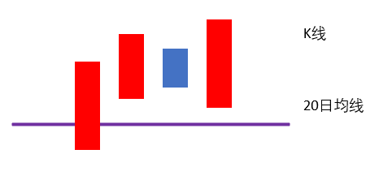

# 浪型解析

识别机构操盘的基本元素，正确区分阳线、阴线，判定上涨浪及下跌浪。

## 定义解析

阳线|阴线
-|-
开盘价 < 收盘价 | 开盘价 > 收盘价
 | 

**上涨浪**判定要素

1. 阳线收盘价突破20日均线
2. 未来3天收盘价在20日均线上方（*注：未来3天不区分阴线、阳线*）

**下跌浪**判定要素

1. K线收盘价跌破20日均线
2. 未来3天收盘价在20日均线下方（*注：未来3天不区分阴线、阳线*）

上涨浪 | 下跌浪
-|-
{:height="100px" width="400px"} | {:height="100px" width="400px"}

## 实战要点

1. “指数”只看整数位，不需要四舍五入
2. “个股”看小数点后2位，不需要四舍五入
3. 适用周期：日线

### 上涨浪确立形态

{:height="100px" width="400px"} 

### 下跌浪确立形态

{:height="100px" width="400px"}

### 基础操盘箴言

- 永远只在上涨浪内买入及持有个股
- 永远不在下跌浪内买入及持有个股
